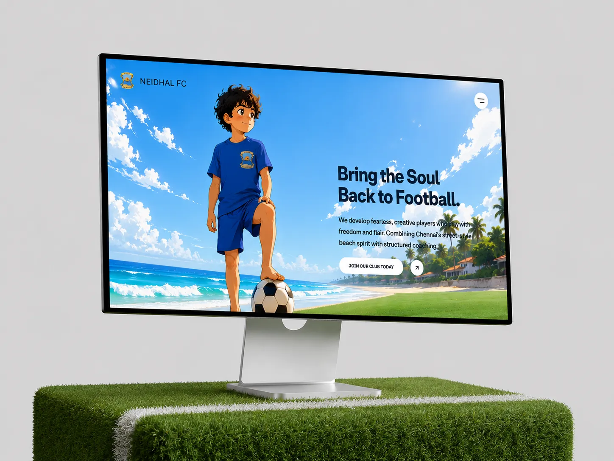
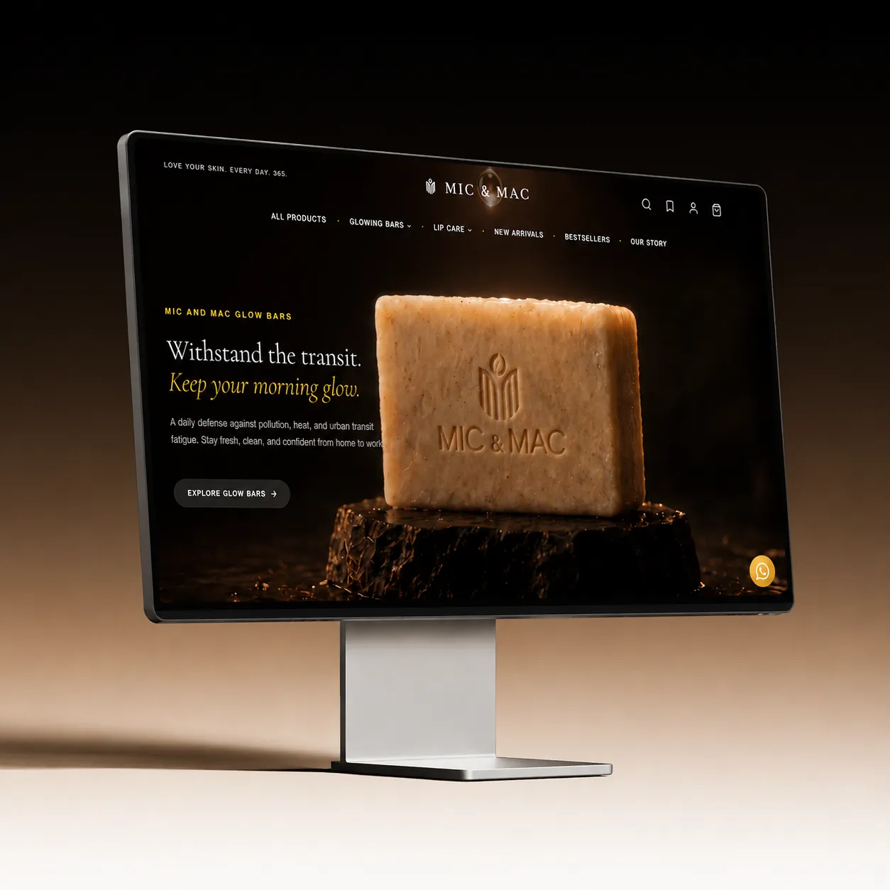

<picture>
  <source media="(prefers-color-scheme: dark)" srcset="assets/banner-dark.webp" />
  
</picture>

  
  

 

<picture><source media="(prefers-color-scheme: dark)" srcset="assets/dark/section-01-whoami.svg"/></picture>
<picture><source media="(prefers-color-scheme: dark)" srcset="assets/dark/card-whoami.svg"/></picture>
<picture><source media="(prefers-color-scheme: dark)" srcset="assets/dark/section-02-projects.svg"/></picture>

<table align="center">
  <tr>
    <td align="center">
      
    </td>
    <td align="center">
      
    </td>
  </tr>
</table>
<picture><source media="(prefers-color-scheme: dark)" srcset="assets/dark/section-03-telemetry.svg"/></picture>

  <picture><source media="(prefers-color-scheme: dark)" srcset="https://github-readme-activity-graph.vercel.app/graph?username=Melvinkheturus&bg_color=00000000&color=ffffff&line=818cf8&point=ffffff&area_color=818cf8&area=true&hide_border=true&radius=6&custom_title=CONTRIBUTION%20TELEMETRY"/></picture>

<picture><source media="(prefers-color-scheme: dark)" srcset="assets/dark/section-04-journey.svg"/></picture>
<picture><source media="(prefers-color-scheme: dark)" srcset="assets/dark/card-experience.svg"/></picture>
<picture><source media="(prefers-color-scheme: dark)" srcset="assets/dark/section-05-stack.svg"/></picture>
<picture><source media="(prefers-color-scheme: dark)" srcset="assets/dark/card-stack.svg"/></picture>

> [!NOTE]
> This README is a living snapshot so links, projects, and focus areas may change as I build and grow.  
> Check back often for updates and new projects.

---

